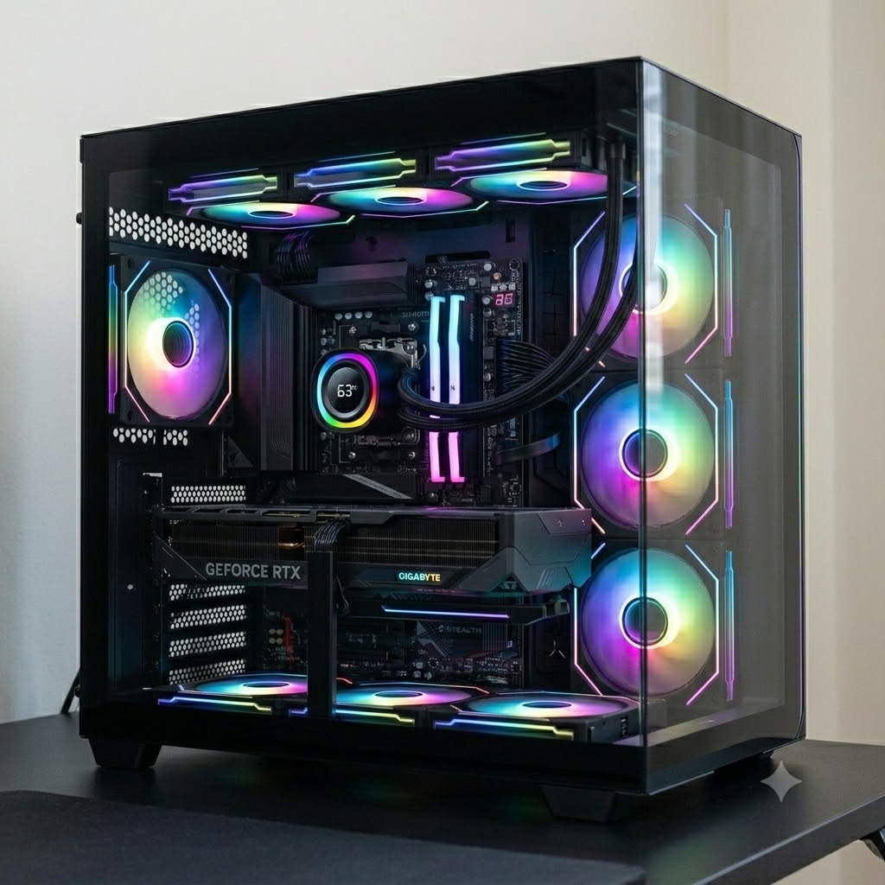

# ✦ 電腦硬體升級深度分析報告

### 12400 + 4060Ti → 7700 + RTX 5070Ti

**✦ Gemini Pro · 視覺豐富版**

📄 另有精美版本：[**HTML 報告**](report.html) ｜ [**PDF 報告**](report.pdf)

---

這份報告針對你從現有的 Intel 平台（12400 + 4060 Ti 8G）升級至原價屋估價單中的 AMD 新世代背插平台（7700 + RTX 5070 Ti 16G）進行全方位的用料分析、品牌對比、遊戲效能、AI 生圖與訓練、以及多工處理評估。

---

## 📋 新舊電腦規格對比摘要

| 核心組件 | 舊電腦規格 (現役) | 新電腦規格 (預計升級) | 升級核心效益 |
| :--- | :--- | :--- | :--- |
| **中央處理器 (CPU)** | Intel i5-12400 (6C/12T) | AMD Ryzen 7 7700 MPK (8C/16T) | 多工執行緒增加，單核與多核效能顯著提升 |
| **主機板 (Motherboard)** | MSI PRO B760M-A WIFI D4 | Gigabyte B850 AORUS STEALTH | 升級為新世代背插式設計，供電與擴充性大改進 |
| **記憶體 (RAM)** | 32GB (16GBx2) DDR4 | Biwin 佰維 Black Opal 48GB (24GBx2) DDR5-6000 CL28 | 超低延遲（CL28），容量提升至 48GB 滿足 AI 與多工 |
| **顯示卡 (GPU)** | NVIDIA RTX 4060 Ti 8GB | 技嘉 RTX 5070 Ti GAMING OC 16G | 換代 Blackwell 架構，**視訊記憶體翻倍 (8G → 16G)** |
| **固態硬碟 (SSD)** | Micron Crucial P5 Plus 1TB (Gen4) | 致態 ZhiTai TiPro9000 1TB (Gen5) | 頻寬翻倍，讀寫速度提升至 14000 MB/s 極速 |
| **散熱器 (Cooler)** | 原廠或入門空冷 | ID-COOLING FX360 TD 黑 360水冷 | 帶有數位監控顯示，解熱能力極大過剩（壓制7700輕而易舉） |
| **電源供應器 (PSU)** | 650W | 微星 MPG A850GS PCIE5 850W | 支援 ATX 3.1 / PCIe 5.1，應對新世代顯卡瞬時功耗 |
| **機殼 (Case)** | 舊有機殼 | 全漢 M580 PRO-BA 全景無視角機殼 | 支援背插主機板，極致雙艙美觀與散熱優化 |

---

## 🔍 第一部分：新菜單零件用料與設計深度分析

### 1. CPU：AMD Ryzen 7 7700 MPK（代理商含風扇）
* **用料與定位**：採用 TSMC 5nm 工藝，Zen 4 架構，8 核 16 執行緒。MPK 代表簡易包裝（通常附帶原廠風扇），內容物與盒裝完全相同，但價格更實惠。
* **特點**：預設 TDP 僅 65W，積熱問題相較於 X 版本較輕，能耗比極高。在 2026 年這個時間點，作為高性價比的 8 核遊戲與多工主力非常稱職。

### 2. 主機板：技嘉 B850 AORUS STEALTH（背插式）
* **用料與定位**：屬於技嘉次世代的「背插式（Project Stealth）」中高階主機板。晶片組升級至 B850，完整支援新世代電路配置。
* **供電規格**：高達 **14+2+2 相** 數位供電設計，搭配大面積的散熱裝甲。這種供電等級不僅能完美發揮 7700 的效能，未來若想升級更高階的 9000 系列或未來的 Ryzen CPU 也完全不需要擔心供電不足。
* **特色**：所有接線接口（24PIN、CPU 8PIN、SATA、風扇插座）全部移至主機板背面，正面視覺極致乾淨，大幅優化機殼內部的風道散熱。

### 3. 記憶體：Biwin 佰維 Black Opal DW100 RGB 48GB (24GBx2) DDR5-6000 CL28
* **用料與定位**：這是高階發燒友級別的非對稱雙通道記憶體（Non-Binary RAM）。
* **核心價值**：最驚人的是其 **CL28 超低時序**（一般 DDR5-6000 多為 CL30 或 CL36）。這代表它篩選了極致特挑的 Hynix（海力士）A-die 或高階顆粒。低時序對於 AMD 平台的記憶體延遲（Latency）有極大改善，能顯著提升 0.1% Low 幀數（減少遊戲微卡頓）。48GB 的容量剛好填補了 32GB 與 64GB 之間的空白，對 AI 生圖與多工掛機來說是極完美的平衡點。

### 4. 固態硬碟：致態 ZhiTai TiPro9000 1TB (PCIe Gen5)
* **用料與定位**：長江存儲（YMTC）高階 PCIe 5.1 旗艦 SSD，採用最新一代的 3D TLC 閃存顆粒。
* **效能與設計**：讀取高達 14,000 MB/s，寫入 12,500 MB/s，並配備獨立的 DRAM 快取記憶體。Gen5 SSD 最大的考驗在於「發熱量」，這款配備了可拆式厚重散熱片，如果主機板自身有更厚實的散熱甲也可以拆卸替換，用料屬於目前市面頂級。

### 5. 顯示卡：技嘉 RTX 5070 Ti GAMING OC 16G
* **用料與定位**：搭載新一代 Blackwell 架構的次旗艦主力卡，GAMING OC 屬於技嘉的中高階主力系列。
* **散熱與電路**：採用風之力散熱系統（三個獨特刀刃風扇、正逆轉功能、大面積純銅熱導管直接接觸 GPU）。核心預設超頻至 2588MHz。配備高階數字供電與超耐久用料（固態電容、金屬後板）。**16GB 的大視訊記憶體** 徹底解決了 4060 Ti 8GB 的 VRAM 焦慮。

### 6. 散熱器、機殼與電源
* **ID-COOLING FX360 TD**：360mm 一體式水冷，冷頭自帶數位監控顯示螢幕（可看 CPU 溫度/功耗）。用料扎實，用來壓制 65W 的 7700 屬於「極度大材小用」，能確保 CPU 長期運作在極低溫與絕對安靜的狀態。
* **全漢 M580 PRO-BA**：全景海景房機殼，其核心用料特色是**原生支援背插式主機板**。鋼板厚度與玻璃防爆設計優良，內部空間寬敞，完美契合 B850 STEALTH。
* **微星 MPG A850GS 850W**：高品質金牌全模組電源，通過 ATX 3.1 與 PCIe 5.1 規範認證，採用全日系 105°C 電容，升級了最新的 12V-2x6 接口（比舊版 12VHPWR 更安全、更不易熔毀），10 年保固，用料極度安心。

---

## 📊 第二部分：三大品牌（華碩/技嘉/微星）同型號不同等級對比

在 2026 年的硬體市場中，針對 **B850 主機板（背插/高階款）** 與 **RTX 5070 Ti 顯示卡**，三大品牌的梯隊與用料差異如下：

### 1. B850 主機板系列對比

| 品牌 | 旗艦/背插代表型號 | 主力高階型號 | 供電與用料差異 | 價格區間 (預估) |
| :--- | :--- | :--- | :--- | :--- |
| **ASUS (華碩)** | ROG STRIX B850-F GAMING / TUF BTF (背插) | TUF GAMING B850-PLUS | ROG 具備 16+2+2 相 90A Dr.MOS，音效晶片頂級，軟體生態最強。TUF 則走硬朗實用風（12+2+1相）。 | NT$ 7,500 - 8,990 |
| **Gigabyte (技嘉)** | **B850 AORUS STEALTH (背插)** | B850 AORUS ELITE AX | **STEALTH 擁有 14+2+2 相供電**，特色是極致的背插鋼板與散熱甲覆蓋率。ELITE 則是常規常規主機板，擴充性相同但無背插。 | NT$ 6,990 - 7,990 (本單為7990) |
| **MSI (微星)** | MPG B850 CARBON / PROJECT ZERO (背插) | MAG B850 TOMAHAWK | CARBON 供電通常堆最滿（達 75A~90A 級別）。PROJECT ZERO 專攻背插美學。TOMAHAWK（戰斧飛彈）則以大面積黑化散熱片與高性價比著稱。 | NT$ 7,200 - 8,700 |

* **效能差異**：在相同 CPU (7700) 下，主機板等級對「純運算效能」影響小於 2%，主要差異在於**極限超頻穩定性、PCIe通道分配（是否會跟第二支SSD搶頻寬）、以及外觀（背插美觀度）**。
* **新單優勢**：你選的 **B850 AORUS STEALTH** 在背插美學與供電平衡度上是目前的頂級選擇，價格定位合理。

### 2. RTX 5070 Ti 顯示卡系列對比

| 品牌 | 頂級旗艦梯隊 (頂級用料) | 主力核心梯隊 (均衡用料) | 入門普及梯隊 (基礎用料) |
| :--- | :--- | :--- | :--- |
| **ASUS (華碩)** | ROG Strix / ProArt | TUF Gaming | Dual / Prime |
| **Gigabyte (技嘉)** | AORUS Master (超級雕) | **GAMING OC (魔鷹，本單選擇)** | Eagle / Windforce |
| **MSI (微星)** | SUPRIM X (超龍) | GAMING X TRIO (魔龍) / SLIM | Ventus 3X (萬圖師) |

#### 🛠️ 三大梯隊用料、價格與效能深度解構：
1.  **頂級旗艦 (ROG Strix / AORUS Master / SUPRIM X)**
    * **用料**：採用超越公版規格 1.5 倍以上的供電相數（例如 20+3 相），搭配全金屬外殼、高階導熱貼、真空腔均熱板（Vapor Chamber）、甚至帶有 LCD 顯示螢幕。
    * **價格**：定價極高，通常會比常規款貴出 NT$ 4,000 - 7,000（預估落在 41,000+）。
    * **效能與優勢**：出廠時脈最高，超頻潛力大，滿載溫度比入門款低 5-8°C，噪音極低。缺點是體積龐大（常達3.5槽以上）且性價比低。
2.  **主力核心 (TUF / GAMING OC / GAMING X TRIO) —— ✨ 本單選擇**
    * **用料**：最均衡的選擇。採用常規強化供電（如 14+2 相），標準三風扇、多根純銅熱導管與厚實的金屬強化背板。具備雙 BIOS 雙模式切換。
    * **價格**：中規中矩（本單為 NT$ 36,990）。
    * **效能與優勢**：效能與旗艦款差距僅在 **1% - 3%** 之間（體感完全無解）。散熱表現優異，運作壽命長，是聰明消費者的首選。
3.  **入門普及 (Dual / Windforce / Ventus)**
    * **用料**：塑料外殼居多，散熱鰭片較薄，供電相數踩在 NVIDIA 官方底線。沒有炫目的 RGB 燈效。
    * **價格**：通常為官方建議售價（MSRP），約 NT$ 33,900 - 34,900。
    * **效能與優勢**：性價比最高，體限通常較短，適合小機殼。缺點是滿載時風扇轉速較高、噪音略大，溫度略高。

---

## 🎮 第三部分：1080p 遊戲效能與 CPU 瓶頸分析

你目前使用的是 1080p 解析度，特效全開的情況下，這次升級堪稱**「毀滅性提升」**：

### 1. 三大類遊戲實測效能預估
* **3A 大作 (如 Cyberpunk 2077、黑神話：悟空、Alan Wake 2 等)**
    * *舊電腦 (12400 + 4060Ti 8G)*：1080p 特效全開、開啟光追與 DLSS 質量，大約能維持在 60 - 80 FPS。但遇到部分爆 VRAM 的場景會瞬間掉幀（卡頓）。
    * *新電腦 (7700 + 5070Ti 16G)*：新一代 Blackwell 架構的光追與 AI 幀生成技術（DLSS 4/5 世代）迎來質變。1080p 原生極致特效（甚至不開 DLSS）即可輕鬆破 **150+ FPS**；開啟光追與路徑追蹤後更能穩定在 **120+ FPS**。16GB VRAM 讓所有高解析度紋理完全不卡頓。
    * *提升幅度*：**約 120% - 150% 的純效能增長。**
* **特戰英豪 (Valorant) 等電競射擊遊戲**
    * *舊電腦 (12400 + 4060Ti 8G)*：電競幀數主要看 CPU 單核效能。12400 大約能提供 280 - 350 FPS。
    * *新電腦 (7700 + 5070Ti 16G)*：Ryzen 7 7700 的 Zen 4 架構擁有更大的 L3 快取與極高的單核頻率，再搭配 **Biwin DDR5-6000 CL28 超低延遲記憶體**（電競遊戲對記憶體延遲極其敏感），幀數會直接狂飆至 **550 - 700+ FPS**。
    * *提升幅度*：**約 80% - 100% 的幀數提升**，完美餵滿 360Hz 甚至更高階的電競螢幕。
* **Cities: Skylines (大都市：天際線 1 & 2)**
    * *舊電腦 (12400 + 4060Ti 8G)*：這款遊戲是著名的「CPU 與記憶體殺手」。人口破 10 萬後，12400 (6核) 的模擬速度會嚴重變慢，32GB DDR4 的頻寬也會成為瓶頸，導致切換視角、拉近建築時嚴重掉幀、卡頓。
    * *新電腦 (7700 + 5070Ti 16G)*：7700 擁有 **8 個全大核/16執行緒**，能大幅加快後台市民 AI、交通路網的模擬計算速度（Simulation Speed 顯著提升）。48GB DDR5 帶來極大的頻寬與容量，加載大量 Mod 與資產（Assets）時不會再發生記憶體溢出。
    * *提升幅度*：**畫面流暢度（0.1% Low）預估提升 60% 以上，中後期模擬卡頓感大幅消失。**

### 2. ⚠️ 1080p 解析度下的 CPU 瓶頸 (Bottleneck) 分析
* **結論：在 1080p 解析度下，必定會產生 CPU 瓶頸。**
* **原因**：RTX 5070 Ti 16G 的效能極其強悍，它的定位實際上是 **2K 極致光追 / 4K 高畫質** 的顯示卡。在 1080p 解析度下，顯卡渲染一幀的時間極短，會將壓力瘋狂回傳給 CPU，此時強如 Ryzen 7 7700 也無法在短時間內處理完那麼多繪圖指令（Draw Calls）。
* **表現形式**：你在玩 3A 大作時，會發現 **GPU 使用率可能只有 60% - 70%**，無法跑到 99% 滿載，而 CPU 的部分核心會吃滿。
* **建議**：這套規格非常建議在未來**升級至 2K (2560x1440) 144Hz+ 或是 4K 螢幕**。切換到 2K/4K 後，顯卡使用率會回升至 99%，徹底釋放 5070 Ti 的怪獸級效能，且畫面精細度會有本質上的飛躍。

---

## 🤖 第四部分：AI 生圖 (ComfyUI) 與 LoRA 訓練深度分析

這部分是此次升級**最震撼、最具價值**的地方。你目前的 4060 Ti 8G 在跑現代複雜 AI 工作流時正處於嚴重窒息狀態。

### 1. 理論速度與提升分析（為什麼你以前慢？）
* **你目前的痛點**：
    * `Z-Image-Turbo` 運作時（模型約 6GB），加上 `Qwen 4B FP4` 語言模型，再算上 ComfyUI 基礎框架與系統 VRAM 佔用，總體需求已經高達 **9GB - 10GB**。
    * 由於你的 4060 Ti 只有 8GB，系統會被迫開啟 **「共享系統記憶體 (Shared System Memory)」**，將放不下的 1-2GB 模型數據丟到慢速的 DDR4 記憶體中（DDR4 速度約 50GB/s，而顯卡視訊記憶體速度約 288GB/s）。
    * 這種來回的 PCIe 跨界讀取，就是導致你 Z-Image-Turbo 只有 **2s/it**（極慢）的根本原因！
* **升級後的跨世代躍升**：
    * **RTX 5070 Ti 擁有 16GB VRAM**。上述總共 9-10GB 的模型工作流可以 **100% 完整塞進視訊記憶體** 中，完全不需要用到共享記憶體。
    * Blackwell 架構升級了全新的 Tensor Core（第五代），並對 **FP4 / FP8 等低精度量化模型有硬體級別的晶片原生加速**。
* **🚀 速度預估對比**：

| 工作流模型 | 舊電腦速度 (4060Ti 8G) | 新電腦速度 (5070Ti 16G) | 預估提升倍率 |
| :--- | :--- | :--- | :--- |
| **Z-Image-Turbo + Qwen 4B** | ~ 2 s / it (卡VRAM) | **~ 0.05 - 0.1 s / it** (完全融入VRAM+FP4硬體加速) | **20倍+ 爆發性提升** (生一張圖只需零點幾秒) |
| **Illustrious XL (SDXL 衍生)** | ~ 2 it / s (每秒2步) | **~ 8 - 12+ it / s** (每秒8-12步) | **4 - 6 倍速度提升** |

### 2. 新電腦能嘗試的新模型
有了 16GB 視訊記憶體與新架構，你將解鎖以往完全不敢碰的頂級模型：
1.  **FLUX.1 (Dev / Schnell)**：2024-2026 年最強大的開源生圖模型。細節、文字生成與手部結構完勝 SDXL。以前 8G VRAM 根本開不起來，現在你可以流暢運行 **FLUX.1 Dev (FP8 版本)**，享受極致畫質。
2.  **大參數文字編碼器 (T5-XXL FP16/FP8)**：能完美理解極其複雜、長篇大論的 Prompt（提示詞），生圖不再漏掉關鍵字。
3.  **SD3.5 Large (8B 參數)**：16G VRAM 能輕鬆吃下，並能同時開啟多個 ControlNet 進行精確姿勢、線稿控制。

### 3. 可否使用 AI-Toolkit 訓練 LoRA？
* **答案：可以，非常輕鬆且流暢！**
* **分析**：
    * `AI-Toolkit` 是目前主流訓練 FLUX 和 SDXL LoRA 的強大工具。
    * 訓練 **SDXL / Illustrious XL LoRA**：在 16GB VRAM 下，你可以使用 AdamW 優化器、**原生不切片、不開啟低記憶體模式（Gradient Checkpointing 可開可不開）**，以 1024x1024 解析度進行高質量訓練，速度飛快。
    * 訓練 **FLUX.1 LoRA**：FLUX 訓練極吃記憶體。以前 8G 絕無可能。現在有了 16GB VRAM，配合 `bitsandbytes` 的 8-bit Adam 優化器以及 FP8 基礎模型，你可以**完全在本地端順利訓練自己的 FLUX LoRA**，這對創作者來說是核心分水嶺。

---

## 🤖 第五部分：多工處理與後台腳本機器人掛機分析

你提到平時會掛載 **三個以上的腳本機器人（如 Python/Node.js 寫成的自動化 Bot）與多個後台程式**，新電腦在這一點上的優勢如下：

1.  **核心調配 (8C/16T vs 6C/12T)**
    * i5-12400 的 6 核心在同時面對「重度 3A 遊戲 + ComfyUI 排隊生圖 + 3個後台機器人」時，容易出現執行緒競爭，導致遊戲瞬間掉幀。
    * Ryzen 7 7700 擁有 **8 個完全相同的全效能大核心**。你可以透過 Windows 工作管理員或腳本本身，將 2 個核心（4執行緒）固定分配給後台腳本與系統雜務，剩下的 6 核心 12 執行緒完全留給遊戲或 AI 計算，做到真正的**互不干擾、背景零感掛機**。
2.  **記憶體頻寬與容積的解放 (48GB DDR5-6000 CL28)**
    * 腳本機器人（尤其是涉及網頁自動化如 Selenium/Puppeteer、或是頻繁進行網路請求的 Bot）非常吃記憶體基底。32GB 在開啟大作與 ComfyUI 後會顯得捉襟見肘。
    * **48GB 提供了額外多達 16GB 的緩衝空間**，你可以多開幾十個 Chrome 分頁、掛載更多機器人。DDR5-6000 的超高頻寬也能大幅加快腳本數據處理與吞吐的速度。

---

## 💡 總結與購買建議

原價屋這張 **NT$ 83,458** 的估價單，不論在用料還是配置邏輯上都極其強悍，**非常適合你的重度 AI 工作流與多工掛機需求**。

* **優點**：背插美學極致乾淨、5070 Ti 16G 帶來 AI 生圖的質變（徹底告別卡 VRAM）、Gen5 SSD 讀寫極速、記憶體時序（CL28）非常極致。
* **唯一溫馨提醒**：
    1.  **強烈建議升級螢幕**：用這台主機跑 1080p 就像把法拉利開在菜市場，CPU 勢必會成為瓶頸。換上 2K 144Hz 或 4K 螢幕才能真正發揮 RTX 5070 Ti 的全部實力。
    2.  **注意背插機殼相容性**：估價單內的 `全漢 M580 PRO-BA` 與 `B850 AORUS STEALTH` 主機板配合得非常完美，這點沒問題，但未來如果自己想更換機殼，一定要確認有標註「支援背插主機板」，否則開孔對不上會無法安裝。
